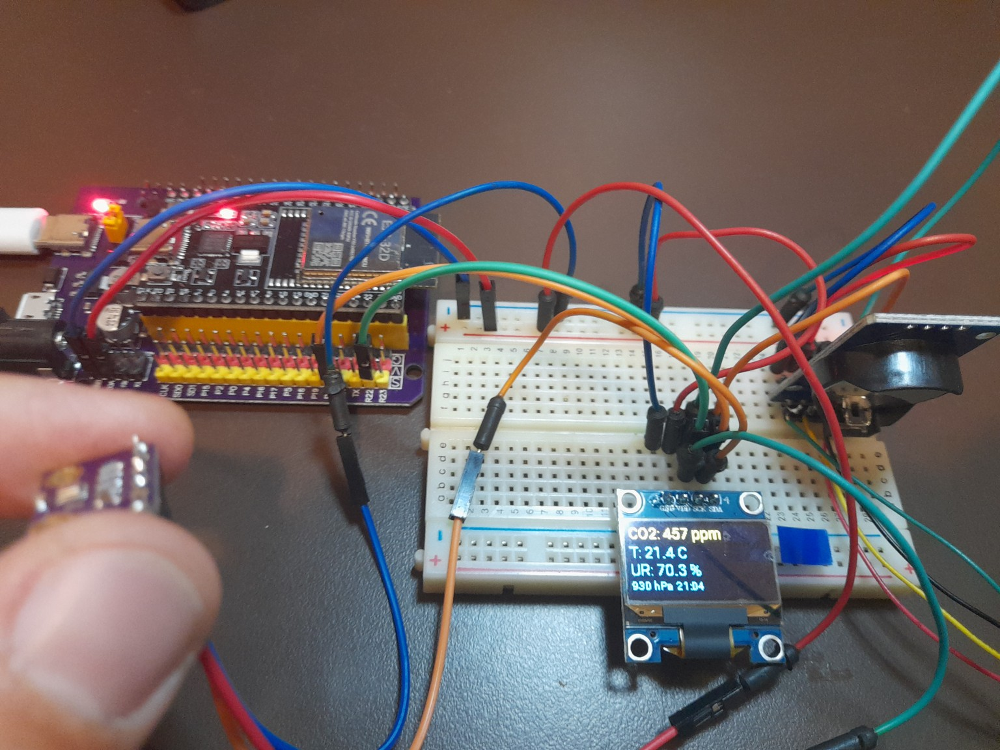
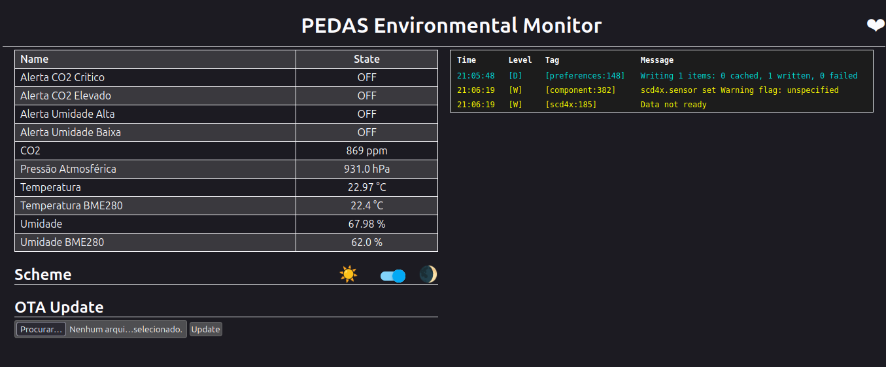
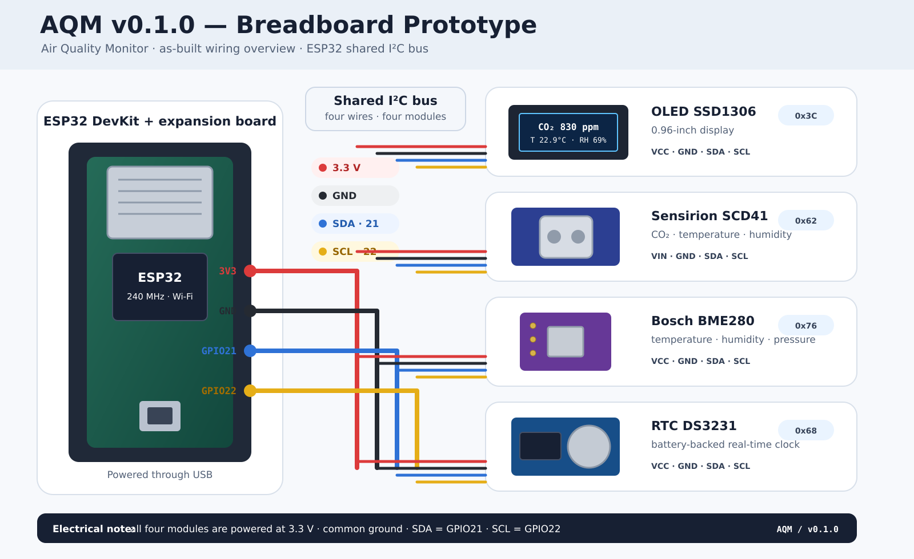

# AQM — Air Quality Monitor



AQM is a modular DIY indoor air-quality monitor built around an ESP32. It is intended for learning, comparative assessment of indoor environments, and progressive development of data-acquisition skills.

> AQM is not a certified air-quality instrument and must not be used for regulatory, occupational-health, legal, or safety-critical measurements.

## Current release

**AQM v0.1.0 — Hardware Architecture A03**  
Reduced-wiring breadboard prototype.

Validated in this release:

- CO₂, temperature and relative humidity from a Sensirion SCD41;
- temperature, relative humidity and atmospheric pressure from a BME280;
- local SSD1306 OLED display;
- local Wi-Fi web interface;
- operational CO₂ and humidity alerts;
- fixed local IP address;
- OTA firmware updates;
- shared I²C bus with automatic device scan;
- modular display configuration loaded from an independent ESPHome package.



## Hardware

| Component | Function | Quantity |
|---|---|---:|
| ESP32 DevKit / ESP32-32D | Main controller | 1 |
| SCD41 module | CO₂, temperature and relative humidity | 1 |
| BME280 module | Pressure, temperature and relative humidity | 1 |
| SSD1306 128×64 OLED | Local display | 1 |
| DS3231-compatible RTC module | Real-time clock hardware | 1 |
| ESP32 expansion board | Power and pin distribution | 1 |
| Breadboard | Prototype assembly | 1 |
| Dupont wires | Interconnection | As required |
| 5 V USB supply | Power source | 1 |

## Bus configuration

### I²C pins

| Signal | ESP32 pin |
|---|---|
| SDA | GPIO21 |
| SCL | GPIO22 |
| Supply | 3.3 V |
| Ground | GND |

### Detected I²C addresses

| Device | Address |
|---|---|
| SSD1306 | `0x3C` |
| SCD41 | `0x62` |
| RTC | `0x68` |
| BME280 | `0x76` |
| RTC module EEPROM, when present | `0x57` |

### Prototype wiring illustration

The illustration below documents the AQM v0.1.0 breadboard prototype. All modules share the same I²C bus and are powered at 3.3 V.



[Open or download the editable SVG version](images/AQM_v0.1.0_breadboard_prototype.svg).

## Firmware installation

1. Install ESPHome.
2. Copy `firmware/secrets.example.yaml` to `firmware/secrets.yaml`.
3. Replace the placeholder Wi-Fi credentials.
4. Review the fixed-IP settings in `AQM_FW_v0.1.2.yaml` before compiling.
5. Compile and install through USB:

```bash
esphome run firmware/AQM_FW_v0.1.2.yaml --device /dev/ttyUSB0
```

After the first successful installation, later updates can be sent by OTA:

```bash
esphome run firmware/AQM_FW_v0.1.2.yaml --device 192.168.0.240
```

See [Commissioning](docs/commissioning.md) for validation steps.

## Network note

The example firmware uses `192.168.0.240` with gateway `192.168.0.1`. This address must be outside the router's DHCP pool or reserved by MAC address. Adapt these values to your own network before installation.

## Repository structure

```text
aqm-air-quality-monitor/
├── README.md
├── LICENSE
├── CHANGELOG.md
├── .gitignore
├── firmware/
│   ├── AQM_FW_v0.1.1.yaml
│   ├── AQM_FW_v0.1.2.yaml
│   ├── display_oled_ssd1306.yaml
│   └── secrets.example.yaml
├── docs/
│   ├── architecture.md
│   ├── commissioning.md
│   ├── roadmap.md
│   ├── troubleshooting.md
│   └── wiring.md
└── images/
    ├── aqm-a03-overview.jpg
    ├── aqm-web-interface.png
    ├── AQM_v0.1.0_breadboard_prototype_preview.png
    └── AQM_v0.1.0_breadboard_prototype.svg
```

## Modular display configuration

The local display is intentionally isolated in `firmware/display_oled_ssd1306.yaml` and loaded by the main firmware through ESPHome `packages`:

```yaml
packages:
  display_dashboard: !include display_oled_ssd1306.yaml
```

This keeps acquisition, networking and alert logic independent from the current OLED. A future SPI TFT dashboard can replace the display package without restructuring the sensor configuration.

## Current limitations

- No historical data logging yet;
- RTC hardware is detected, but time synchronization is not yet implemented;
- breadboard construction is unsuitable for final portable deployment;
- no validation against calibrated reference instruments;
- alert thresholds are project operating limits, not regulatory limits;
- the firmware currently assumes a specific local-network configuration.

## Roadmap

The next planned milestone is **AQM v0.2.0 — Data Logging**, including RTC synchronization, microSD storage and CSV files. See [Roadmap](docs/roadmap.md).

## License

This project is released under the [MIT License](LICENSE).
